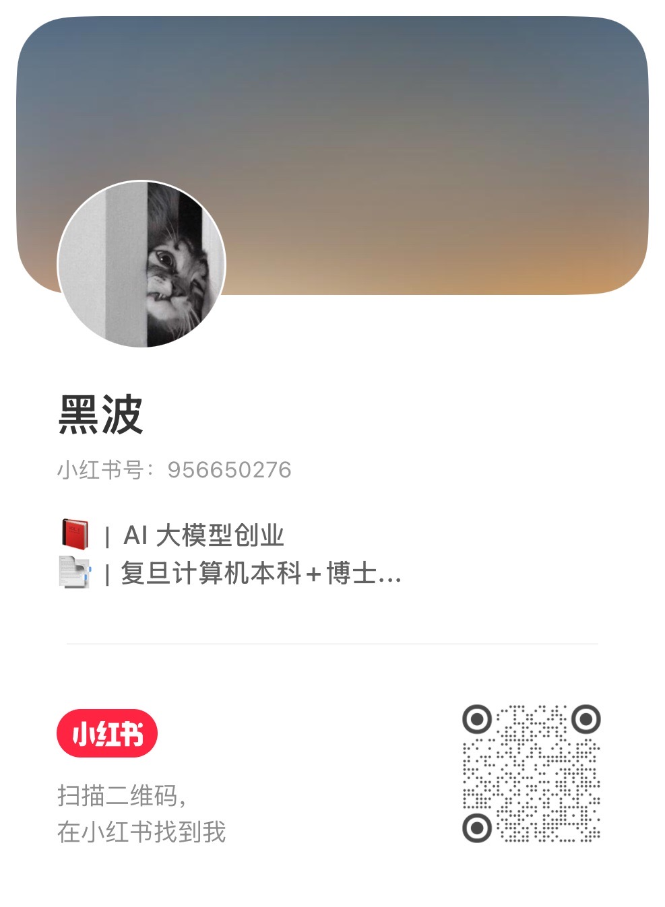

# Clean My WeChat

  

自动删除 PC 端微信自动下载的大量文件、视频、图片等数据内容，解放一年几十 G 的空间占用。

该工具不会删除文字的聊天记录，请放心使用。请给个 **Star** 吧，非常感谢！

**现已经支持 Windows 和 Mac 系统中的所有微信版本，包含最新版的微信 4.0+ 和企业微信。**

Windows 版本：

[国内地址 - 点击下载](
https://wwbie.lanzoue.com/iHgXp3ql84ng)

[Github Release - 点击下载](
https://github.com/blackboxo/CleanMyWechat/releases/download/v2.1/CleanMyWechat.zip)

macOS 版本：

[国内地址 - 点击下载](
https://wwbie.lanzoue.com/ixTMX3r1jomh)

[Github Release - 点击下载](https://github.com/blackboxo/CleanMyWechat/releases/download/v3.1_mac/CleanMyWechat_v3.1_mac.dmg)

## 特性
1. 自动识别所有微信及企业微信账号；
2. 自由设置想要删除的文件类型，包括文件、图片、视频；
3. 自由设置需要删除的文件的距离时间，默认 365 天；
4. 删除后的文件放置在回收站中，检查后自行清空，防止删错需要的文件；
5. 支持定期自动清理；

## 运行截图

## 微信现状

下载两年时间，微信一个软件就占用多达 33.5 G 存储空间。其中大部分都是与自己无关的各大群聊中的文件、视频、图片等内容，且很久以前的文件仍旧存在电脑中。

## Star History

<a href="https://www.star-history.com/?type=date&repos=blackboxo%2FCleanMyWechat">
 <picture>
   <source media="(prefers-color-scheme: dark)" srcset="https://api.star-history.com/chart?repos=blackboxo/CleanMyWechat&type=date&theme=dark&legend=top-left&sealed_token=DaZSGdkfH0eN1_FMODq8_T4qnX1XWj__nZCfBX0zaijuj90RP2hCrljELrMJer3tzPetSKKjwHR5-70Up7ImF-nTnGstPFYV9EOEKe3fHPyRr1nOU-1MVfoUn-gRTZSFS2TiG-1WPZXLVOJLCiTqmH6HeMpcU38u6V5SLoOwfbprkyYsdXNXi2tDW2--" />
   <source media="(prefers-color-scheme: light)" srcset="https://api.star-history.com/chart?repos=blackboxo/CleanMyWechat&type=date&legend=top-left&sealed_token=DaZSGdkfH0eN1_FMODq8_T4qnX1XWj__nZCfBX0zaijuj90RP2hCrljELrMJer3tzPetSKKjwHR5-70Up7ImF-nTnGstPFYV9EOEKe3fHPyRr1nOU-1MVfoUn-gRTZSFS2TiG-1WPZXLVOJLCiTqmH6HeMpcU38u6V5SLoOwfbprkyYsdXNXi2tDW2--" />
   
 </picture>
</a>

## 关注开发者

欢迎在小红书关注开发者，获取最新动态与更新资讯：

